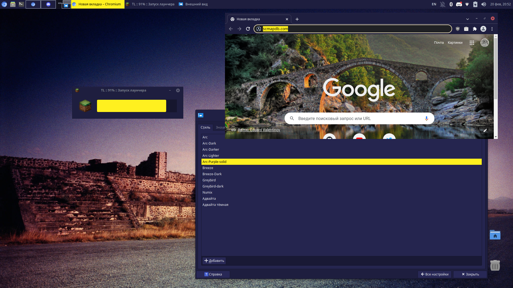
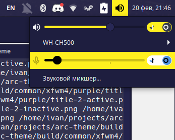

# Arc Purple

Arc is a flat theme with transparent elements for GTK 3, GTK 2 and various desktop shells, window managers and applications. It's well suited for GTK based desktop environments such as GNOME, Cinnamon, Xfce, Unity, MATE, Budgie etc.

The theme was originally designed and developed by [horst3180](https://github.com/horst3180/arc-theme), but the project has been unmaintained since May 2017.

This fork adds a purple-yellow color scheme.

## Supported toolkits and desktops

Arc Purple comes with themes for the following:
* GTK 3
* Xfwm

## Unsupported, but planned toolkits and desktops

* GTK 2
* GTK 4
* GNOME Shell >=3.28
* Cinnamon >=3.8
* Unity
* Metacity
* Plank

## Installation

#### Manual installation

`meson setup --prefix=~/.local -Dvariants=purple -Dthemes=gtk2,gtk3,gtk4,xfwm build/`
`ninja -C build && meson install -C build/`

#### From releases

Download the newest release from GitHub's Releases page and unpack it to `/usr/local/themes`, `~/.themes` or `~/.local/themes`

## Known Issues

Switches look a little bit wacky, not sure how to fix them.

## Contributing

If you'd like to contribute to the project, open an pull request, or an issue for discussion. See [HACKING.md](https://github.com/rndtrash/arc-purple/blob/master/HACKING.md) for further details.

## License

Arc is available under the terms of the GPL-3.0. See [COPYING](https://github.com/rndtrash/arc-purple/blob/master/COPYING) for details.
